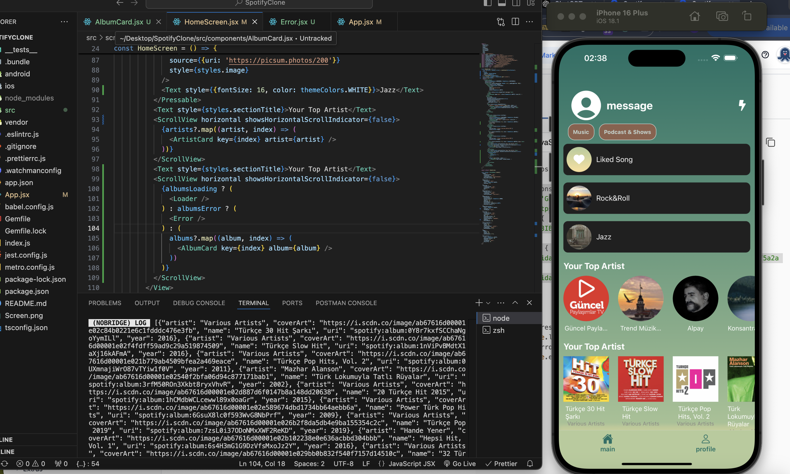
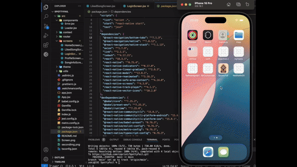

## SpotifyClone -- SpottyFail

Libraries & Technologies Used
@react-navigation/native: For navigation within the app.
@react-navigation/native-stack: To handle stack navigation in the app.
@react-navigation/bottom-tabs: For the bottom tab navigation.
axios: For API calls and data fetching.
lodash: Utility functions for easier data manipulation.
react-native-linear-gradient: To add gradient backgrounds and effects.
react-native-track-player: To manage music playback and controls.
react-native-modal: For creating customizable modal dialogs.
react-native-vector-icons: To use icons for UI elements.
react-native-reanimated: For creating smooth animations.
react-native-safe-area-context: Ensures the app works well on devices with safe areas.
react-native-screens: Optimizes navigation for performance.

